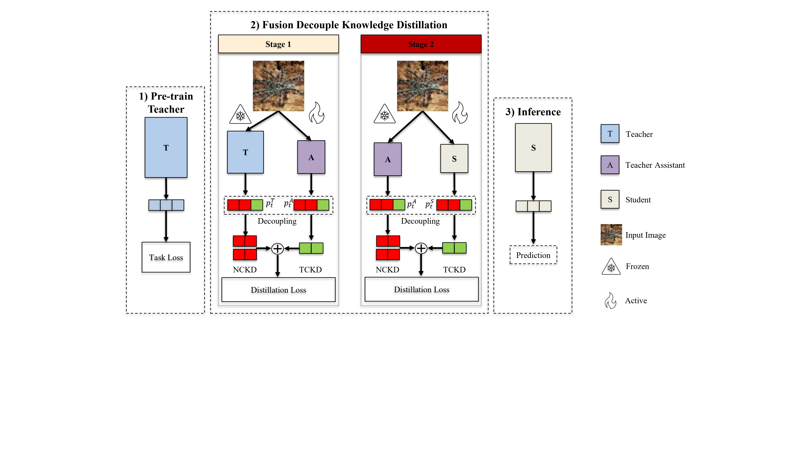

# FDKD: Fusion Decoupled Knowledge Distillation

This repository provides the official implementation of the paper: **Fusion Decoupled Knowledge Distillation for Progressive Knowledge Transfer**

Authors: Quang-Minh Tran†, Viet-Hoang Nguyen† and Vinh-Tiep Nguyen.

> **Abstract:** Knowledge distillation is a standard approach for model compression, but its effectiveness degrades under large teacher–student capacity gaps, resulting in optimization instability or collapse and poor feature alignment. While **Decoupled Knowledge Distillation (DKD)** improves supervision by separating target and non-target components, it does not address capacity mismatch. **Teacher Assistant Knowledge Distillation (TAKD)** alleviates this gap via intermediate models but relies on conventional objectives that entangle signals and propagate noisy logit distributions, limiting training stability under heterogeneous settings. To address this, we propose **Fusion Decoupled Knowledge Distillation (FDKD)**, a unified framework that integrates TAKD with stage-wise decoupled supervision to enable progressive knowledge transfer. Unlike traditional multi-stage methods that rely on conventional KD objectives and propagate noisy logit distributions, FDKD exploits a decoupled objective across the teacher–assistant–student hierarchy, preserving both global category relationships and local sample-specific information as model capacity scales down. Extensive experiments on standard benchmarks demonstrate that the proposed FDKD achieves superior performance under large capacity gaps, **outperforming vanilla TAKD and standalone DKD by 7.53% and 12.58% in top-1 accuracy**, respectively.



---

## 📋 Overview

FDKD combines **TAKD** (Teacher Assistant Knowledge Distillation) with **DKD** (Decoupled Knowledge Distillation) to enable progressive knowledge transfer across large capacity gaps:

```
Stage 1: Teacher (Swin-B, frozen) ──DKD──► Assistant (ResNet-152)
Stage 2: Assistant (frozen)       ──DKD──► Student   (ResNet-18)
```

This repository includes:
- **Interactive Demo** — Conference-quality visualization frontend (Next.js)
- **Inference Backend** — FastAPI server with DKD decomposition, Grad-CAM, metrics
- **Training** — MMPretrain/MMRazor configs (see `training/`)

---

## 🏗 Project Structure

```
Project_CS338/
├── run_colab.py                        ← Colab launcher (entry point)
│
├── utils/                              ← Shared modules (used by all)
│   ├── config.py                       ← Global config (single source of truth)
│   ├── distributions.py                ← Softmax, logits_to_probs, top-k
│   ├── math_utils.py                   ← KL divergence, cosine, entropy, rank_corr
│   ├── image.py                        ← Image preprocessing
│   ├── labels.py                       ← Tiny ImageNet class labels
│   └── tiny_imagenet_labels.json       ← 200-class label mapping
│
├── backend/                            ← FastAPI inference backend
│   ├── main.py                         ← FastAPI app + API routes
│   ├── requirements.txt
│   ├── models/
│   │   └── loader.py                   ← Model loading + checkpoint finder
│   ├── inference/
│   │   ├── pipeline.py                 ← T → A → S inference
│   │   ├── dkd.py                      ← TCKD / NCKD decomposition
│   │   └── metrics.py                  ← Distribution-level metrics
│   └── visualization/
│       └── gradcam.py                  ← Grad-CAM heatmaps
│
├── frontend/                           ← Next.js interactive demo
│   ├── src/app/                        ← Pages + global styles
│   ├── src/components/                 ← UI components (10 components)
│   ├── src/hooks/                      ← State management (Zustand)
│   ├── src/services/                   ← API client (Axios)
│   └── src/types/                      ← TypeScript definitions
│
├── training/                           ← MMPretrain + MMRazor configs
│   ├── README.md                       ← Training instructions
│   └── configs/
│       ├── _base_/                     ← Shared base configs
│       ├── distill_dkd/                ← DKD distillation (FDKD Stage 1 & 2)
│       ├── distill_fitnets/            ← FitNets baseline
│       ├── distill_crd/                ← CRD baseline
│       ├── distill_kd/                 ← Vanilla KD baseline
│       └── distill_ofd/                ← OFD baseline
│
└── checkpoints/                        ← Place .pth files here (gitignored)
```

---

## 🚀 Quick Start

### 1. Backend — Google Colab (T4 GPU)

```python
# Cell 1: Clone & install
!git clone https://github.com/YOUR_USER/Project_CS338.git
!pip install -r Project_CS338/backend/requirements.txt

# Cell 2: Mount Google Drive
from google.colab import drive
drive.mount('/content/drive')

# Cell 3: Start server
import sys
sys.path.insert(0, '/content/Project_CS338')
from run_colab import start_server

start_server(
    checkpoint_dir="/content/drive/MyDrive/checkpoints",
    ngrok_token="YOUR_NGROK_AUTH_TOKEN"
)
```

Copy the printed ngrok URL (e.g., `https://xxxx.ngrok-free.app`).

### 2. Frontend — Local

```bash
cd frontend
npm install
npm run dev
# Open http://localhost:3000 → paste ngrok URL → upload image
```

### 3. Deploy Frontend to Vercel

```bash
cd frontend
npx vercel
```

---

## 🔬 Architecture

```
Google Colab (T4 GPU)                    Vercel / localhost:3000
┌────────────────────────┐              ┌──────────────────────────┐
│  FastAPI Backend        │   ngrok     │  Next.js Frontend         │
│  ├── PyTorch inference  │◄──────────►│  ├── Model Comparison     │
│  ├── DKD decomposition  │   HTTPS    │  ├── Distribution Charts  │
│  ├── Grad-CAM           │            │  ├── DKD Analysis (TCKD/  │
│  └── Metrics            │            │  │   NCKD/Dark Knowledge)  │
│                         │            │  ├── Grad-CAM Viewer      │
│  Google Drive mounted   │            │  └── Metrics Dashboard    │
│  └── checkpoints/*.pth  │            │                           │
└────────────────────────┘              └──────────────────────────┘
```

---

## 📊 Checkpoint Mapping

The backend auto-detects checkpoint directories by name:

| Directory | Model Role | Architecture |
|---|---|---|
| `swinb_fully/` | Teacher | Swin-B (86.95M) |
| `dkd_swinb_r152/` | Assistant (FDKD Stage 1) | ResNet-152 (58.55M) |
| `dkd_r152(distilled)_r18/` | Student (FDKD Stage 2) | ResNet-18 (11.28M) |
| `r152_fully/` | Assistant (baseline) | ResNet-152 |
| `r18_fully/` | Student (baseline) | ResNet-18 |
| `dkd_swinb_r18/` | Student (direct DKD) | ResNet-18 |
| `fitnets_swinb_r18/` | Student (FitNets) | ResNet-18 |

---

## 🏋️ Training

Training uses **MMPretrain + MMRazor** framework. See [`training/README.md`](training/README.md) for:
- Environment setup
- Config files for each distillation method
- Training commands

---

## 📈 Results (Tiny ImageNet)

| Method | Top-1 | Top-5 | Params |
|---|---|---|---|
| Swin-B (Teacher) | 90.81% | 98.42% | 86.95M |
| ResNet-18 (Supervised) | 68.87% | 87.72% | 11.28M |
| DKD (direct) | 63.06% | 83.85% | 11.28M |
| FitNets | 73.30% | 91.03% | 11.28M |
| **FDKD (ours)** | **75.85%** | **92.16%** | **11.28M** |

---

## 🛠 Tech Stack

**Backend:** Python, FastAPI, PyTorch, timm, pytorch-grad-cam, scipy  
**Frontend:** Next.js 14, TypeScript, TailwindCSS, Framer Motion, Recharts  
**Training:** MMPretrain, MMRazor  
**Deployment:** Google Colab (GPU), Vercel (frontend), ngrok (tunnel)

---

## 📄 Citation

```bibtex
@article{tran2025fdkd,
  title={Fusion Decoupled Knowledge Distillation: Knowledge Transfer via Decoupling Teaching Assistant},
  author={Tran, Q.-M. and others},
  journal={Pattern Recognition Letters},
  year={2025}
}
```
